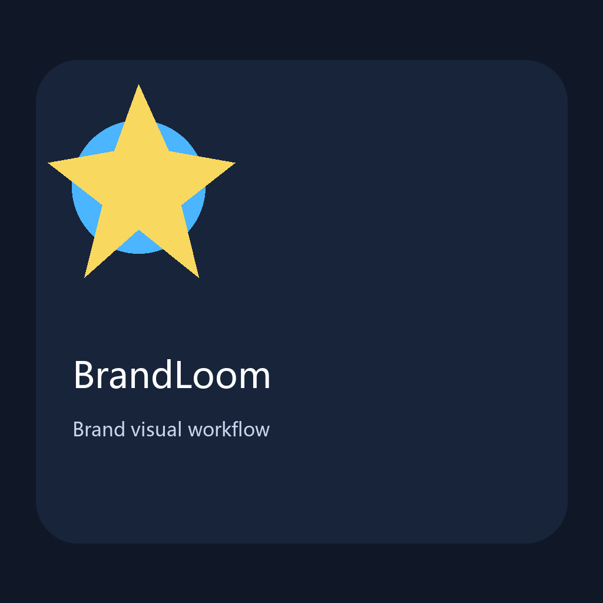
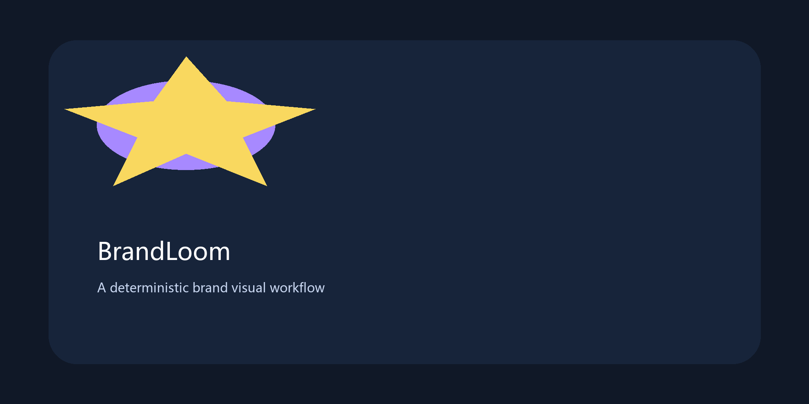

# BrandLoom

BrandLoom 是一个面向 Codex 的品牌视觉工作流 Skill。它通过一次一个问题的确认式 QA，整理项目上下文、文案、风格、字体、品牌素材、使用权和输出规格，再生成可追溯的 LOGO 主视觉、项目标志与项目封面。

BrandLoom 不是一段一次性生图提示词，而是一套本地优先、可确认、可复用、可审计的品牌视觉流程。

当前默认输出尺寸：

- `logo-card`：1254×1254，1:1
- `cover`：1774×887，2:1
- GitHub Social Preview：1280×640

## 一、这个仓库是什么？

这个仓库包含可安装的 `brandloom` Codex Skill，以及它所需的：

- QA 状态机与任务路由
- 品牌档案、素材库和授权 provenance
- 文案、风格、字体和构图参考规则
- JSON 模板与生成 manifest
- Pillow 确定性排版和图像合成脚本
- 自动化测试、示例图片和发行包构建脚本

BrandLoom 会先理解项目，再确认视觉决策，最后生成视觉资产。

## 二、适合谁用？

### 1、特别适合

- 一人公司、独立开发者和 AI Builder
- 产品设计师、品牌设计师和内容创作者
- 需要为 GitHub 项目、Skill、软件或数字产品建立统一视觉的人
- 已有公司 LOGO、项目标志、IP 或参考素材，需要持续复用的人
- 需要中文、英文或双语视觉版本的人
- 重视素材权利、版本记录和可重复交付的人

### 2、不适合

- 只想“一句话立即生成图片”、不愿完成确认流程的人
- 没有素材使用权或无法确认授权状态的项目
- 需要图片模型重新绘制正式公司 LOGO 的场景
- 需要自动商标注册、Figma 云协作、云端发布或批量生成几十种平台尺寸的场景
- 需要未经人工复核就自动公开发布生成内容的场景

## 三、它会产出什么？

BrandLoom 可以产出：

- 1:1 LOGO 主视觉：`1254×1254`
- 2:1 横向项目封面：`1774×887`
- GitHub Social Preview：`1280×640`
- 中文、英文和中英双语版本
- 仅 LOGO、仅封面和视觉变体
- 可分别配置的 LOGO 主视觉与封面 IP 组合
- 项目标志、确定性排版文案和功能信息
- 生成 manifest、输入素材哈希、输出路径和版本记录
- `plan-only` 路由下的文案方向、shot list 和图片提示词

内置 IP 为 `author-anime`、`tuotuo` 和 `xingbi`，三者同等级可选，支持单独、两两和三者共七种组合。

## 四、具有什么价值？

- **视觉一致性**：公司 LOGO、项目标志、IP、字体和文案遵循同一个品牌档案。
- **文字可控**：关键中英文文字由 Pillow 确定性排版，减少图片模型生成错字。
- **素材可追溯**：记录来源、SHA-256、授权状态、保存范围和默认范围。
- **流程可复用**：确认过的品牌选择可以用于本地化、编辑和后续变体。
- **风险更可控**：未达到 `GENERATION_READY` 前不会调用图片工具。
- **本地优先**：运行时状态、模板、品牌档案和 manifest 使用 JSON，不上传素材库，也不启用遥测。
- **失败边界清晰**：图片工具不可用或失败时硬停止，不索取 API Key，也不切换其他服务。

## 五、示例效果

以下示例是仓库内的项目自有 Pillow 确定性合成示例，用于展示排版、品牌素材和版本链路。它们不是宿主图片生成工具的最终视觉验收样本。

<p align="center">
  
  
  
</p>

示例文件实际尺寸：

- `logo-card-zh.png`：1024×1024
- `logo-card-en.png`：1024×1024
- `cover-2x1.png`：2048×1024

最终视觉发布仍需要在宿主图片工具可用的环境中进行人工复核。

## 六、安装方法

### 从源码安装

需要 Python 3.12 或更高版本。

```bash
git clone https://github.com/yangjing6213-dev/project-brand-studio.git
cd project-brand-studio
python -m pip install -r requirements-runtime.txt
```

将仓库中的 `brandloom/` 目录复制到 Codex skills 目录：

```text
<CODEX_HOME>/skills/brandloom/
```

重新打开工作区后即可调用 Skill。

### 构建发行包

```bash
python scripts/build_skill_package.py
```

构建结果为 `dist/brandloom.zip`。发行包只包含 `brandloom/` 的可发行内容，不包含开发状态、测试、staging 素材或本地生成输出。

## 七、如何使用？

在 Codex 中输入：

```text
Use $brandloom
```

例如：

```text
Use $brandloom，为我的开源项目制作中文和英文 LOGO 主视觉，以及一张 GitHub 项目封面。
```

BrandLoom 的 Skill 路由包括：

- `new`：为新项目建立品牌视觉
- `edit`：修改已有视觉并保留未变更的确认
- `localize`：复用已确认底图生成其他语言版本
- `variant`：生成新的平台、尺寸或风格变体
- `plan-only`：只输出文案、构图和提示词计划
- `analysis-only`：只分析项目上下文和未确认事项
- `custom-IP`：按权利和保存范围流程接入自定义 IP

其中 `analysis-only` 与 `custom-IP` 是 Skill 对话路由，不是 `brandloom_cli.py` 的 TaskMode 参数。

## 八、项目工作流程

```text
分析项目与可访问材料
        ↓
一次一个问题的确认式 QA
        ↓
确认文案、风格、字体、LOGO、项目标志、IP、构图和尺寸
        ↓
确认素材使用权、保存 scope 和默认 scope
        ↓
进入 GENERATION_READY
        ↓
调用宿主内置图片工具生成无关键文字底图
        ↓
验证返回路径、可读性、比例和尺寸
        ↓
使用 Pillow 合成 LOGO、项目标志和关键文字
        ↓
执行内部 QA
        ↓
先展示并验收 LOGO 主视觉
        ↓
生成并验收封面、双语版本或其他变体
        ↓
写入 manifest、版本记录并交付
```

LOGO 主视觉与封面可以分别选择 IP 组合。按项目确认结果，方形主视觉可以关闭人物/IP，横向封面可以加入人物或 IP。

## 九、项目目录结构

```text
project-brand-studio/
├─ brandloom/
│  ├─ SKILL.md
│  ├─ USAGE.md
│  ├─ agents/
│  ├─ assets/
│  │  └─ defaults/
│  ├─ references/
│  ├─ templates/
│  └─ scripts/
│     ├─ brandloom_cli.py
│     └─ brandloom_core/
├─ docs/
│  ├─ examples/
│  └─ images/
├─ scripts/
│  └─ build_skill_package.py
├─ tests/
├─ .github/
│  └─ workflows/
├─ README.md
├─ README.en.md
├─ NOTICE.md
├─ LICENSE
└─ requirements-runtime.txt
```

以下目录仅用于本地开发或运行，不会自动加入 Git：

```text
.brandloom/
staging/brand-assets/
dist/
```

## 十、注意实现

- 最低 Python 版本为 3.12。
- 唯一运行时第三方依赖为 `Pillow==12.3.0`。
- 运行时状态、模板、品牌档案和 manifest 使用 JSON，不增加 YAML 解析依赖。
- 公司正式 LOGO 必须使用确认过的原始文件，只能等比缩放，不由图片模型重绘，也不改变字形或几何结构。
- 关键中英文文字使用 Pillow 确定性排版。
- 图片工具只能使用当前宿主提供的内置工具。
- 工具不可用、失败、返回空路径、文件不可读或尺寸不符时硬停止。
- 不请求 API Key，不切换 Images API、SDK、第三方服务或递归 Codex。
- 不覆盖原始素材、已生成文件或历史版本。
- 所有上传素材都必须确认使用权、保存 scope 和默认 scope。
- 公开发行包只包含具有 provenance 且 `authorization_status` 为 `user_authorized` 的资产。
- 第三方商业参考海报只能提炼抽象风格，不进入公开发行包。
- 自定义尺寸只适用于显式本地 JSON 模板与 renderer API，并需要重新验证；CLI compose 与宿主请求通道只接受固定默认尺寸，不能通过缩放无效返回制造通过。
- 生成内容对外发布前必须进行人工复核，并按需要说明 AI 参与。
- 源代码和文档适用 MIT License；公司 LOGO、IP 和示例图片的权利以 `NOTICE.md` 及各自 provenance 记录为准。

## 十一、相关项目

- 直接运行依赖：无。
- 工作流结构参考：`cognitive-anchor-sketcher`，仅作为 QA 状态机、Skill 组织和插图生成流程的参考，不是 BrandLoom 的运行时依赖。

## 十二、关于作者


### 1、Enhe（恩禾）

产品设计师 · 一人公司实践者 · AI Builder

用 AI 打造一个人公司。

- GitHub：[@yangjing6213-dev](https://github.com/yangjing6213-dev)
- X/Twitter：[@Amenenhe_ai](https://x.com/Amenenhe_ai)
- 网站：[www.enhe-tech.com.cn](https://www.enhe-tech.com.cn/)
- 微信：Hu-Amen
- 邮箱：[amen.enhe@gmail.com](mailto:amen.enhe@gmail.com)

[恩禾 ENHE AI｜AI 工具、AI 资讯、账号服务与技能课程](https://www.enhe-tech.com.cn/)

## 十三、继续探索

BrandLoom 是我用 AI 搭建的个人生成系统中的一个工具。

如果你也在用 AI 做内容、知识库、工作流或产品化，可以登录我的网站查看更多资料：

[www.enhe-tech.com.cn](https://www.enhe-tech.com.cn/)
